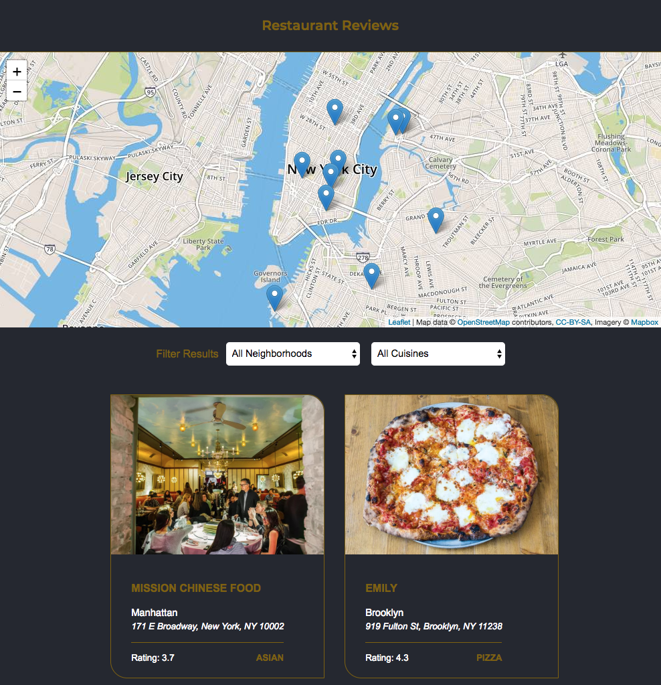

# Restaurant Reviews App
---

This is the project for Udacity's [ Front-End Web Developer](https://www.udacity.com/course/front-end-web-developer-nanodegree--nd001) Nanodegree Program. It was developed using HTMl, CSS, and JavaScript. It focuses on responsive design, accessibility and offline availability.
The [starter code](https://github.com/udacity/mws-restaurant-stage-1) will serve as a baseline to  to convert a static webpage to a mobile-ready web application.


## Table of Contents

- [Project Overview](#project_overview)
- [Dependencies](#dependencies)
- [Added Features](#added_features)
- [Installation](#installation)
- [Live Preview](#live_preview)
- [Screenshots](#screenshots)

## Project Overview


In the  **Restaurant Reviews** App, the user can search for restaurants based on neighbourhood or cuisine type. The map will be updated based on the filters applied. The user can see the details of each restaurant, by clicking on each card.   
In this project, a static webpage that lacks accessibility is converted to a a mobile-ready web application that is responsive on different sized displays and accessible for screen reader use.. The static design lacks accessibility. A service worker is added to begin the process of creating a seamless offline experience for your users.


###  Dependencies

- vanilla.js
- CSS3
- HTML5  
- External libraries used:
  - Normalize.css
  - leafletjs with Mapbox


###  Added Features

- Convert the provided site to use a responsive design.

- Implement accessibility features in the site HTML.

- Add a ServiceWorker script to cache requests to all of the site’s assets (so that any page that has been visited by a user will be accessible when the user is offline)

## Installation

  1. Download or clone the repository
  ```
    - git clone git@github.com:ShaggyT/restaurant-reviews-app.git
    - cd restaurant-reviews-app
  ```
  2. In a terminal, check the version of Python you have: ```python -V```. If you have Python 2.x, spin up the server with ```python -m SimpleHTTPServer 8000 ```(or some other port, if port 8000 is already in use.) For Python 3.x, you can use ```python3 -m http.server 8000```. If you don't have Python installed, navigate to Python's website to download and install the software.

      * Note -  For Windows systems, Python 3.x is installed as `python` by default. To start a Python 3.x server, you can simply enter `python -m http.server 8000`.


  3. View the app in your browser at ``` http://localhost:8000 ```


###  Live Preview
To play the game, [Click Here!](https://udacityrestaurantreviewsapp.netlify.com)

###  Screenshots


